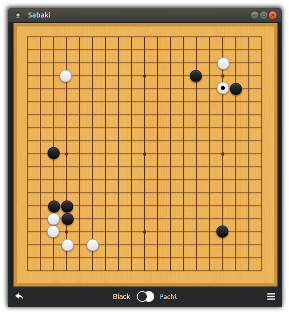

Pachi
=====
//缺少配置输入命令才能运行
//sudo apt install git make gcc g++ libcaffe-cpu-dev libboost-all-dev libgflags-dev libgoogle-glog-dev libprotobuf-dev libopenblas-dev

Pachi can refer to: a simple modular framework for programs playing
the game of Go/Weiqi/Baduk, and a reasonably strong engine built
within this framework.


pachi可以参考：一个简单的程序播放模块化框架围棋/围棋/巴杜克的游戏，以及一个相当强大的引擎在这个框架内。


## Engine

The default engine plays by Chinese rules and should be about 7d KGS
strength on 9x9. On 19x19 it can hold a solid KGS 2d rank on modest
hardware (Raspberry Pi 3, dcnn) or faster machine (e.g. six-way Intel
i7) without dcnn.

When using a large cluster (64 machines, 20 cores each), it maintains
KGS 3d to 4d and has won e.g. a 7-stone handicap game against Zhou Junxun 9p.

By default, Pachi currently uses the UCT engine that combines
Monte Carlo approach with tree search; UCB1AMAF tree policy using
the RAVE method is used for tree search, while the Moggy playout
policy using 3x3 patterns and various tactical checks is used for
the semi-random Monte Carlo playouts.  Large-scale board patterns
are used in the tree search.

引擎

默认引擎按照中国的规则运行，大约为7d kgs9x9强度。在19x19上，它可以保持一个坚实的KGS二维等级硬件（Raspberry PI 3、DCNN）或更快的机器（如六路Intel）I7）无DCNN。当使用大型集群（64台机器，每个20核）时，它会维护KGS 3d到4d，并赢得了7石障碍赛对周俊勋9p。默认情况下，Pachi当前使用的UCT引擎树搜索的蒙特卡罗方法；UCB1AMAF树策略使用Rave方法用于树搜索，而Moggy播放使用3x3模式和各种战术检查的策略用于半随机蒙特卡洛决赛。大型板型在树搜索中使用。


## Binary Releases

**Windows**: download binary [release](https://github.com/pasky/pachi/releases)
for windows and follow instructions inside.

**Ubuntu**: there's a 'pachi-go' package in my [ppa](https://launchpad.net/~lemonsqueeze/+archive/ubuntu/pachi):

    sudo add-apt-repository ppa:lemonsqueeze/pachi
    sudo apt-get update
    sudo apt-get install pachi-go

> Performance might be better if you recompile for your own system though.

二进制释放

Windows:下载二进制版本

对于窗户，请按照里面的说明操作。

Ubuntu：我的购电协议中有一个“pachi-go”包：

> 不过，如果您为自己的系统重新编译，性能可能会更好。

## Installation

Currently *nix, Mac and Windows are supported. To build Pachi, simply type:

	make



The resulting binary program `pachi` is a GTP client. Connect to it
with your favorite Go program interface (e.g. [gogui][1], [sabaki][2], [qgo][3]),
or use [kgsGtp][4] to connect it to KGS.

> DO NOT make the GTP interface accessible directly to untrusted users
> since the parser is not secure - see the [HACKING](HACKING?raw=true)
> file for details.

[1]: https://sourceforge.net/projects/gogui/
[2]: http://sabaki.yichuanshen.de/
[3]: http://qgo.sourceforge.net/
[4]: http://www.michna.com/kgsbot.htm

The pachi program can take many parameters, as well as the particular
engine being used; the defaults should be fine for initial usage,
see below for some more tips.

In case you hit compilation issues (e.g. when building on MacOS/X)
or want to change the build configuration, check the user configurable
section at the top of the Makefile.


安装

 目前支持*nix、mac和windows。要构建pachi，只需键入：


生成的二进制程序pachi是一个gtp客户机。连接到它使用您最喜欢的Go程序界面（例如Gogui、Sabaki、QGo）。或者使用kgsgtp将其连接到kgs。

> 不要让不受信任的用户直接访问GTP接口
> 由于解析器不安全-请参阅黑客攻击
> 有关详细信息的文件。


pachi程序可以接受许多参数，也可以接受特定的正在使用的引擎；初始使用的默认值应该是罚款的，请参阅下面的更多提示。

如果遇到编译问题（例如在MacOS/X上构建时）或者要更改生成配置，请检查用户可配置生成文件顶部的节。

## DCNN support

Pachi can use a neural network as source of good moves to consider.
This makes it about 1 stone stronger and makes the games
more pretty. With dcnn support Pachi can also run on modest hardware
with very few playouts, or even no playouts at all using the raw dcnn
engine (not recommended for actual play, pachi won't know when to pass
or resign !).

One drawback however is that pondering and dcnn can't be used at the same
time right now (you should get a warning on startup).

To build Pachi with DCNN support:
- Install [Caffe](http://caffe.berkeleyvision.org)  
  CPU only build is fine, no need for GPU, cuda or the other optional
  dependencies.
- Edit Makefile, set DCNN=1, point it to where caffe is installed and build.

Install dcnn files in current directory.
Detlef Schmicker's 54% dcnn can be found at:  
  http://physik.de/CNNlast.tar.gz

More information about this dcnn [here](http://computer-go.org/pipermail/computer-go/2015-December/008324.html).

If you want to use a network with different inputs you'll have to tweak
dcnn.c to accomodate it. Pachi will check for `golast19.prototxt` and
`golast.trained` files on startup and use them if present when
playing on 19x19.


Pachi可以使用神经网络作为良好动作的来源来考虑。这使它的强度增加了1石，使比赛更加激烈。更漂亮。有了DCNN支持，Pachi还可以在普通硬件上运行只有很少的出局，甚至根本没有使用原始DCNN的出局引擎（不推荐实际播放，Pachi不知道什么时候通过或者辞职！.
然而，一个缺点是思考和DCNN不能同时使用现在就开始（启动时会收到警告）。要使用dcnn支持构建pachi，请执行以下操作：

-安装咖啡
		只使用CPU的构建很好，不需要GPU、CUDA或其他可选的依赖关系。
-编辑makefile，设置dcnn=1，指向安装和构建caffe的位置。

在当前目录中安装dcnn文件。

Detlef Schmicker的54%DCNN位于：
网址：http://physik.de/cnnlast.tar.gz
有关此DCNN的详细信息，请访问此处。
如果你想使用不同输入的网络，你必须调整DCNN.C来适应它。Pachi将检查golast19.protottxt和启动时使用golast.trained文件，并在出现时使用它们在19x19上播放。


## How to run

By default Pachi will run on all cores, using up to 200Mb of memory for tree
search and taking a little under 10 seconds per move.  You can adjust these
parameters by passing it extra command line options.

For main options description try:

        ./pachi --help

**Time Settings**

Pachi can smartly deal with a variety of time settings (canadian byoyomi
recommended to maximize efficient time allocation). However, most of these
are accessible only via GTP, that is by the frontend keeping track of time,
e.g. KGS or gogui.

It's also possible to force time settings via the command line (GTP
time settings are ignored then).

For example:

	./pachi -t 20

Will make Pachi use 20s per move.

	./pachi -t =5000:15000 threads=4,max_tree_size=100

This will make Pachi play with max 15000 playouts per move on 4 threads,
taking up to 100Mb of memory (+ several tens MiB as a constant overhead).
It should be about 2d with dcnn and large patterns setup.

	./pachi -t _1200 --no-dcnn threads=8,max_tree_size=3072,pondering

This will make Pachi play without dcnn with time settings 20:00 S.D. with 8 threads,
taking up to 3GiB of memory, and thinking during the opponent's turn as well.

**Logs**

Pachi logs details of its activity on stderr, which can be viewed via
`Tools->GTP Shell` in gogui. Tons of details about winrates, memory usage,
score estimate etc can be found here. Even though most of it available through
other means in gogui, it's always a good place to look in case something
unexpected happens.

`-d <log_level>` changes the amount of logging (-d0 suppresses everything)  
`-o log_file` logs to a file instead. gogui live-gfx commands won't work though.

**Large patterns**

Pachi can also use a pattern database to improve its playing performance.  
You can get it at http://pachi.or.cz/pat/ - you will also find further
instructions there.

**Opening book**

> Mostly useful when running without dcnn (dcnn can deal with fuseki).

Pachi can use an opening book in a Fuego-compatible format - you can
obtain one at http://gnugo.baduk.org/fuegoob.htm and use it in Pachi
with the -f parameter:

	./pachi -f book.dat ...

You may wish to append some custom Pachi opening book lines to book.dat;
take them from the book.dat.extra file. If using the default Fuego book,
you may want to remove the lines listed in book.dat.bad.

**Other Options**

For now, there is no comprehensive documentation of engine options, but
you can get a pretty good idea by looking at the uct_state_init() function
in uct/uct.c - you will find the list of UCT engine options there, each
with a description. At any rate, usually the three options above are
the only ones you really want to tweak.

如何运行

默认情况下，pachi将在所有核心上运行，树占用高达200MB的内存。搜索，每次移动不到10秒。你可以调整这些通过传递额外的命令行选项来传递参数。有关主要选项说明，请尝试：

```bash
    ./pachi --help
```

时间设置

Pachi可以灵活地处理各种时间设置（加拿大Byoyomi建议最大限度地提高时间分配效率）。然而，其中大部分只能通过GTP访问，即前端跟踪时间，例如KGS或Gogui。
也可以通过命令行（GTP）强制设置时间然后忽略时间设置）。
例如：

```c
./pachi -t 20
```

每次移动都会使Pachi使用20秒。

```bash
./pachi -t _1200 --no-dcnn threads=8,max_tree_size=3072,pondering
```

这会让游戏变时滞与不pachi settings 20:00 8与该线程。以3gib of up to the对手的思维和记忆，在AS好转。

```bash
./pachi -t _1200 --no-dcnn threads=8,max_tree_size=3072,pondering
```

日志

pachi在stderr上记录其活动的详细信息，可通过gogui中的`Tools->GTP Shell`。关于winrates，内存使用，分数估计等可以在这里找到。尽管大部分都可以通过在戈盖的另一种方式是，它总是一个很好的地方，以防发生什么事情。意外发生。
`-d <log_level>`更改日志记录的数量（-d0抑制所有内容）
`-o log_file`将文件日志记录到文件中。不过，gogui live gfx命令不起作用。

模式

Pachi还可以使用模式数据库来提高其播放性能。你可以在http://pachi.or.cz/pat/-上找到它，你还可以找到更多说明。

开源库

> 在没有dcnn的情况下运行时最有用（dcnn可以处理fuseki）。

Pachi可以使用与Fuego兼容的开场白格式-您可以在http://gnugo.baduk.org/fuegoob.htm获取一个并在pachi中使用使用-f参数：

```bash
./pachi -f book.dat ...
```

您可能希望在book.dat中附加一些自定义的pachi开卷行；从book.dat.extra文件中获取它们。如果使用默认的Fuego书籍，您可能需要删除book.dat.bad中列出的行。

其他选项

目前，还没有关于发动机选项的全面文档，但是通过查看uct-state_init（）函数，您可以得到一个非常好的主意。在UCT/UCT.C中-您可以在那里找到UCT引擎选项列表，每个选项有描述。无论如何，通常上面的三个选项是你唯一真正想改变的。

## Install

After compiling and setting up data files you can install pachi with:

    make install
    make install-data

Pachi will look for extra data files (such as dcnn, pattern, joseki or
fuseki database) in pachi's system directory (/usr/local/share/pachi by
default) as well as current directory. System data directory can be
overridden at runtime by setting `DATA_DIR` environment variable.

安装

编译和设置数据文件后，您可以使用以下命令安装pachi：

```bash
make install
make install-data
```

Pachi将查找额外的数据文件（如DCNN、Pattern、Joseki或fuseki数据库），位于pachi的系统目录（/usr/local/share/pachi by以及当前目录。系统数据目录可以通过设置数据目录环境变量在运行时重写。


## Analyze commands

When running Pachi through GoGui, a number of graphic tools are available
through the `Tools->Analyze commands` window:

- Best moves
- Score estimate
- DCNN ratings ...

It's also possible to visualize best moves / best sequence while Pachi is thinking
via the live gfx commands.


There are some non-gui tools for game analysis as well, see below.

命令分析

通过Gogui运行Pachi时，可以使用许多图形工具
通过工具->分析命令窗口：
-最佳动作
-分数估计
-DCNN评级…
当帕奇思考时，也可以想象出最佳动作/最佳顺序。
通过实时的gfx命令。

当帕奇思考时，也可以想象出最佳动作/最佳顺序。
通过实时的gfx命令。


## Greedy Pachi

> Mostly useful when running without dcnn

Normally, Pachi cares only for win or loss and does not take into
account the point amount. This means that it will play slack endgame
when winning and crazy moves followed with a resign when losing.

It may give you a more pleasurable playing experience if Pachi
_does_ take into account the point size, strives for a maximum
(reasonable) win margin when winning and minimal point loss when
losing. This is possible by using the maximize_score parameter, e.g.:

	./pachi -t _1200 threads=8,maximize_score

This enables an aggressive dynamic komi usage and end result margin
is included in node values aside of winrate. Pachi will also enter
scoring even when losing (normally, Pachi will never pass in that case).
Note that if you pass any 'dynkomi' parameter to Pachi, you will reset
the values set by 'maximize_score'.

Note that Pachi in this mode may be slightly weaker, and result margin
should not be taken into account when judging either player's strength.
During the game, the winning/losing margin can be approximated from
Pachi's "extra komi" or "xkomi" reporting in the progress messages.

贪婪的Pachi

> 无DCNN运行时最有用

通常，帕奇只关心输赢，而不考虑计算积分金额。这意味着它将在最后一场比赛中当胜利和疯狂的举动随之而来的是辞职当失败。如果帕奇能给你一个更愉快的游戏体验考虑到点的大小，力求最大（合理）赢时赢保证金，赢时损失最小失败的。这可以通过使用最大分数参数来实现，例如：

```bash
./pachi -t _1200 threads=8,maximize_score
```

这可以实现积极的动态Komi使用和最终结果利润率包含在winrate之外的节点值中。Pachi也将进入即使输了也要得分（在这种情况下，帕奇永远不会通过）。请注意，如果您将任何“dynkomi”参数传递给pachi，您将重置“最大化分数”设置的值。
请注意，此模式下的pachi可能稍弱，结果边缘在判断任何一个球员的实力时都不应考虑在内。在比赛中，胜负差额可以近似于Pachi的“Extra Komi”或“XKomi”在进度消息中报告。


## Experiments and Testing

Except UCT, Pachi supports a simple `random` idiotbot-like engine and an
example `montecarlo` treeless MonteCarlo-player. The MonteCarlo simulation ("playout")
policies are also pluggable, by default we use the one that makes use of
heavy domain knowledge.

Other special engines are also provided:
* `distributed` engine for cluster play; the description at the top of
  distributed/distributed.c should provide all the guidance
* `dcnn` engine plays moves according to dcnn policy.
* `replay` engine simply plays moves according to the playout policy suggestions
* `patternplay` engine plays moves according to the learned patterns
* few other purely for development usage

Pachi can be used as a test opponent for development of other go-playing
programs. For example, to get the "plainest UCT" player, use:

	./pachi -t =5000 policy=ucb1,playout=light,prior=eqex=0,dynkomi=none,pondering=0,pass_all_alive

This will fix the number of playouts per move to 5000, switch the node
selection policy from ucb1amaf to ucb1 (i.e. disable RAVE), switch the
playouts from heuristic-heavy moggy to uniformly random light, stop
prioring the node values heuristically, turn off dynamic komi, disable
thinking on the opponent's time and make sure Pachi passes only when
just 10% alive stones remain on the board (to avoid disputes during
counting).

You can of course selectively re-enable various features or tweak this
further. But please note that using Pachi in this mode is not tested
extensively, so check its performance in whatever version you test
before you use it as a reference.

Note that even in this "basic UCT" mode, Pachi optimizes tree search
by considering board symmetries at the beginning. Currently, there's no
easy option to turn that off. The easiest way is to tweak board.c so
that board_symmetry_update() has goto break_symmetry at the beginning
and board_clear has board->symmetry.type = SYM_NONE.

实验和测试

除了UCT之外，Pachi还支持一个简单的、随机的、类似于傻瓜机器人的引擎和一个
蒙特卡洛无树蒙特卡洛播放器示例。蒙特卡洛模拟（“Playout”）。
策略也是可插入的，默认情况下，我们使用
丰富的领域知识。

还提供其他特殊发动机：
	-用于群集播放的分布式引擎；顶部的描述分布式/分布式.c应提供所有指导
	-DCNN引擎根据DCNN策略执行移动。
	-重播引擎只根据播放策略建议播放动作
	-模式播放引擎根据学习的模式播放移动
	-很少有其他纯粹用于开发的
帕奇可以作为测试对手开发其他围棋。程序。例如，要获得“最简单的UCT”播放器，请使用：

```bash
./pachi -t =5000 policy=ucb1,playout=light,prior=eqex=0,dynkomi=none,pondering=0,pass_all_alive
```

这会将每次移动的播放次数固定为5000，切换节点从UCB1AMAF到UCB1的选择策略（即禁用RAVE），切换从启发式重型车到均匀随机轻，停以启发式方式优先处理节点值，关闭动态komi，禁用思考对手的时间，确保帕奇只有在只有10%的活石留在船上（以避免在计数）。

当然，您可以有选择地重新启用各种功能或对此进行调整。进一步。但是请注意，在这种模式下使用pachi没有经过测试广泛地，所以在您测试的任何版本中检查它的性能在用作参考之前。

请注意，即使在这种“基本UCT”模式下，Pachi也可以优化树搜索。从一开始就考虑到董事会的对称性。目前，没有很容易选择关闭它。最简单的方法是调整board.c，所以该板的对称性在开始时必须破坏对称性。而board_clear有board->symmetry.type=sym_none。


## Game Analysis

Pachi can also help you analyze your games by being able to provide
its opinion on various positions. The user interface is very rudimentary,
but the ability is certainly there.

There are currently several Pachi interfaces provided for this purpose.

**Winrate Development**

Pachi can evaluate all moves within a given game and show how
the winrates for both players evolved - i.e. who was winning at which
game stage. This is implemented using the `tools/sgf-analyse.pl` script.
See the comment on top of the script about its usage.

**Move Ranking**

Pachi can evaluate all available moves in a given situation
and for each give a value between 0 and 1 representing perceived
likelihood of winning the game if one would play that move. I.e. it can
suggest which moves would be good and bad in a single given situation.

To achieve the latter, note the number of move at the situation you
want to evaluate and run the `tools/sgf-ratemove.sh` script.
See the comment on top of the script about its usage.

**Pattern Move Hinting**

Pachi can show instantenous pattern-based move suggestions very much
like for example Moyo Go Studio (though of course without a GUI).
You can use the Move Ranking method above (tools/sgf-ratemove.sh),
but pass it an extra parameter '-e patternplay'.

博弈分析

Pachi还可以通过提供它对各种立场的看法。用户界面非常简单，但这种能力确实存在。

目前为此目的提供了几个pachi接口。

WinRate开发

Pachi可以评估给定游戏中的所有动作并显示两个玩家的胜利者都在进化，也就是说谁赢了游戏阶段。这是使用tools/sgf-analyse.pl脚本实现的。请参阅脚本顶部关于其用法的注释。
移动排序
Pachi可以评估给定情况下的所有可用移动对于每一个，给出一个介于0和1之间的值，表示感知到的如果有人会采取这种行动，他就有可能赢得比赛。即它可以建议在单一情况下采取哪些行动是好的和坏的。要实现后者，请注意在您的情况下移动的次数想要评估并运行tools/sgf-ratemove.sh脚本。请参阅脚本顶部关于其用法的注释。
模式移动提示
Pachi可以很好地显示基于即时模式的移动建议比如Moyo Go Studio（当然没有图形用户界面）。您可以使用上面的移动排名方法（tools/sgf ratemove.sh）。但是传递一个额外的参数-e patternplay。


## Framework

The aim of the software framework is to make it easy to plug your
engine to the common infrastructure and implement your ideas while
minimalizing the overhead of implementing the GTP, speed-optimized
board implementation, etc.  Also, there are premade random playout
and UCT tree engines, so that you can directly tweak only particular
policies.  The infrastructure is pretty fast and it should be quite
easy for you (or us) to extend it to provide more facilities for
your engine.

See the [HACKING](HACKING?raw=true) file for a more detailed developer's view of Pachi.

Also, if you are interested about Pachi's architecture, algorithms
etc., consider taking a look at Petr Baudis' Master's Thesis:

http://pasky.or.cz/go/prace.pdf

...or a slightly newer scientific paper on Pachi:

http://pasky.or.cz/go/pachi-tr.pdf

框架

该软件框架的目的是使插入推动共同的基础设施，并在最小化实施GTP的开销，优化速度
执行董事会等，也有预谋的随机播放。和UCT树引擎，这样您就可以直接调整政策。基础设施相当快，应该相当快方便您（或我们）扩展它，为你的引擎。

有关pachi的更详细的开发人员视图，请参阅黑客文件。另外，如果您对Pachi的体系结构感兴趣，算法等等，考虑看看彼得鲍迪斯的硕士论文：
网址：http://pasky.or.cz/go/prace.pdf
…或是一篇稍新的关于帕奇的科学论文：
http://pasky.or.cz/go/pachi-tr.pdf


## Licence

Pachi is distributed under the GPLv2 licence (see the [COPYING](COPYING?raw=true)
file for details and full text of the licence); you are welcome to tweak
it as you wish (contributing back upstream is welcome) and distribute
it freely, but only together with the source code. You are welcome
to make private modifications to the code (e.g. try new algorithms and
approaches), use them internally or even to have your bot play on the
internet and enter competitions, but as soon as you want to release it
to the public, you need to release the source code as well.

One exception is the Autotest framework, which is licenced under the
terms of the MIT licence (close to public domain) - you are free to
use it any way you wish.

许可证

pachi是根据gplv2许可证分发的（参见复制申请许可证的详细信息和全文）；欢迎调整
如您所愿（欢迎向上游捐款）并分发它是自由的，但只能与源代码一起使用。不客气对代码进行私有修改（例如尝试新算法和方法），在内部使用它们，甚至让您的机器人在上网参加比赛，但只要你想发布对于公众，您还需要发布源代码。
一个例外是自动测试框架，它在麻省理工学院许可证条款（接近公共领域）-您可以自由随心所欲地使用它。